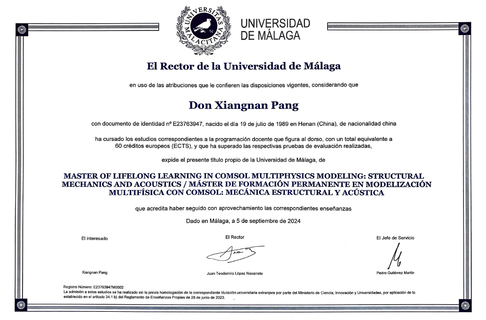

# COMSOL Multiphysics Certificate Portfolio

This repository showcases my training and certificates in **COMSOL Multiphysics Modeling**, with a focus on **Structural Mechanics and Acoustics**.

## Credential

- **Program:** Master of Lifelong Learning in COMSOL Multiphysics Modeling: Structural Mechanics and Acoustics
- **Institution:** University of Málaga
- **Credits:** 60 ECTS
- **Completed:** 2024

## Topics Covered

- Mathematical foundations
- Basic methods in COMSOL Multiphysics
- Geometry, materials, and meshing
- Studies, solvers, and results
- Structural mechanics
- Acoustics
- Nonlinear structural material models
- Multiphysics
- MEMS
- Physics Builder
- Application Builder
- Optimization
- MATLAB and COMSOL
- Java methods in COMSOL

## Certificate

- COMSOL Master Certificate  
  

## Author

**Xiangnan Pang**  
Ph.D. in Solid Mechanics

## Copyright

© Xiangnan Pang. All rights reserved.